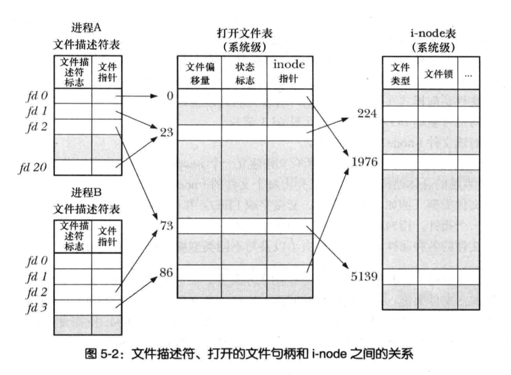
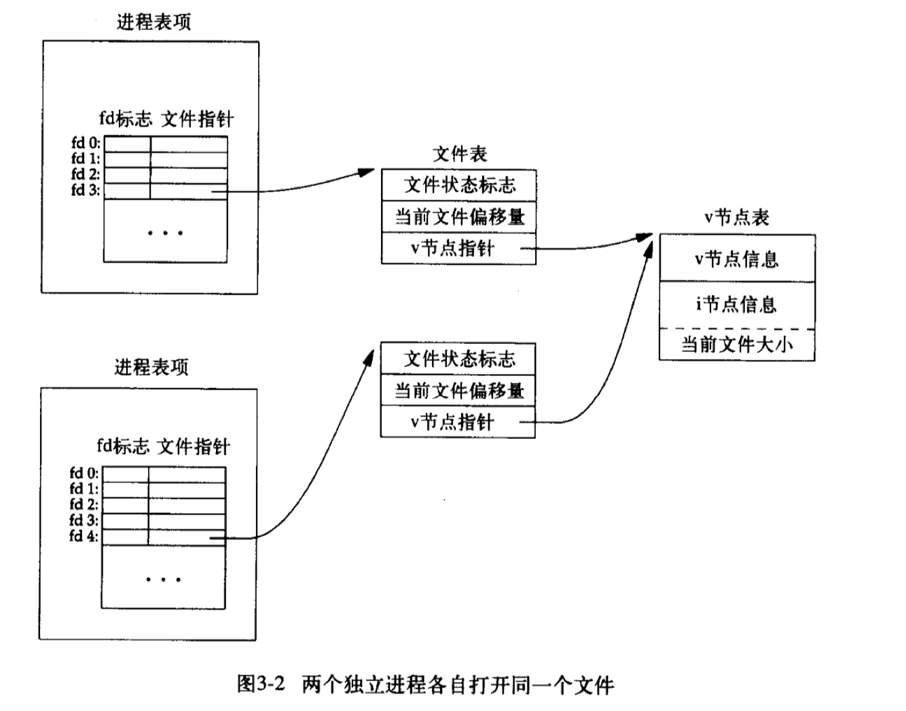

# 文件描述符、打开文件表以及inode

linux系统相关书籍中关于文件描述符及相关内容，通常会出现一张类似这样的图



或者这样的图



第一个图来自Michael Kerrisk的《Linux/UNIX系统编程手册》，第二个图来自《UNIX环境高级编程》(也就是APUE)。

文中对相关信息做了论述并且配上了上面这样的图，但是我相信很多人看完以后觉得好像懂了，那么请尝试想一想一下几个问题：

1.假如创建了文件a得到了文件描述符fa1，并且正在写入的过程中再次打开文件a得到了文件描述符fa2。这个时候通过fa2对文件重命名，会有什么结果。

2.fa2对文件重命名后，通过fa1获得的文件名是原来的文件名还是修改后的文件名。

3.fa1能否继续写入。

如果以上3个问题完全没有疑惑，说明已经对文件描述符及相关内容掌握的非常清楚，可以不用继续看下去了。如果还有疑问，那么请看下面这段代码

```go
func main() {

	fileOldName := "rotate.log"
	fileRename := "rotate1.log"
	file, _ := os.OpenFile(fileOldName, os.O_CREATE|os.O_WRONLY|os.O_APPEND, os.FileMode(0644))

	fmt.Println("open file", fileOldName)
	for i := 0; i < 5; i++ {
		file.WriteString(fmt.Sprintf("%v line: %d\n", time.Now(), i))
	}

	var statOldFile syscall.Stat_t
	if err := syscall.Stat(fileOldName, &statOldFile); err != nil {
		panic(err)
	}

	fmt.Println(fileOldName, "statOldFile.Ino:", statOldFile.Ino)

	err := os.Rename(fileOldName, fileRename)
	if err != nil {
		fmt.Println("file rename Error:", err)
	}

	fmt.Println("rename ", fileOldName, "->", fileRename)

	var statRenamedFile syscall.Stat_t
	if err := syscall.Stat(fileRename, &statRenamedFile); err != nil {
		panic(err)
	}

	fmt.Println("fileRename", "statRenamedFile.Ino:", statRenamedFile.Ino)

	fmt.Println("file.Name:", file.Name())

	for i := 5; i < 10; i++ {
		file.WriteString(fmt.Sprintf("%v line: %d\n", time.Now(), i))
	}

	fileOld, err := os.OpenFile(fileOldName, os.O_WRONLY|os.O_APPEND, os.FileMode(0644))

	if nil != err {
		fmt.Println(fileOldName, " open error:", err)
	} else {
		fmt.Println("fileOld.Name:", fileOld.Name())
	}

}
```

运行后的输出为

```shell
open file rotate.log
rotate.log statOldFile.Ino: 28567907
rename  rotate.log -> rotate1.log
fileRename statRenamedFile.Ino: 28567907
file.Name: rotate.log
rotate.log  open error: open rotate.log: no such file or directory
```

rotate1.log文件中有10行记录。

上面的代码首先创建了一个名为rotate.log的文件，然后写入了5行记录，打印出文件的inodeID 28567907，然后将文件重命名为rotate1.log，再次打印文件的inodeID 28567907，继续写入5条记录，打印文件对象的名字，最后再次打开文件rotate.log，提示文件不存在。

现在来分析一下程序的逻辑：

1. 创建并打开文件rotate.log其inodeID为28567907，file对象中包含了一个文件描述符姑且称为FA1，指向一个文件表项姑且称为FT1，FT1指向一个V节点项。此V节点项的文件就是inodeID为28567907的rotate.log文件，写入了5条记录。

2. 利用rename将文件rotate.log重命名为rotate1.log。实际就是打开了一个文件描述符FA2，指向文件表FT2，FT2指向inodeID为28567907的V节点项，也就是前文的rotate.log，将V节点中这个文件的文件名属性修改为rotate1.log，文件还是那个文件，因此打印出来的inodeID还是那个inodeID。

3. file对象再次写入5条记录，FA1没变，FT1没变，V节点中的inode没变，仅仅只是文件名属性变了，因此记录依然写入了原来那个文件，虽然文件名已经变了。

4. 打印file对象的文件名属性，显示是修改前的名字，因为file对象的name属性在创建时已经赋值，即使V节点中的文件名已经修改，file对象中的name不会变。

5. 再次打开rotate.log会发现已经打不开了，因为这个文件已经不存在了，毕竟V节点中这个文件现在已经叫rotate1.log了。

6. rotate1.log中有10行记录，其中5行是改名前写入的，5条是改名后写入的。

通过这个例子，大概能明白文章开头的两个图了吧。

为啥文件名叫rotate.log？因为logrotate就是重命名后再次用原名创建新文件继续写的。

更多golang示例代码见 [https://github.com/changjixiong/goNotes](https://github.com/changjixiong/goNotes)

